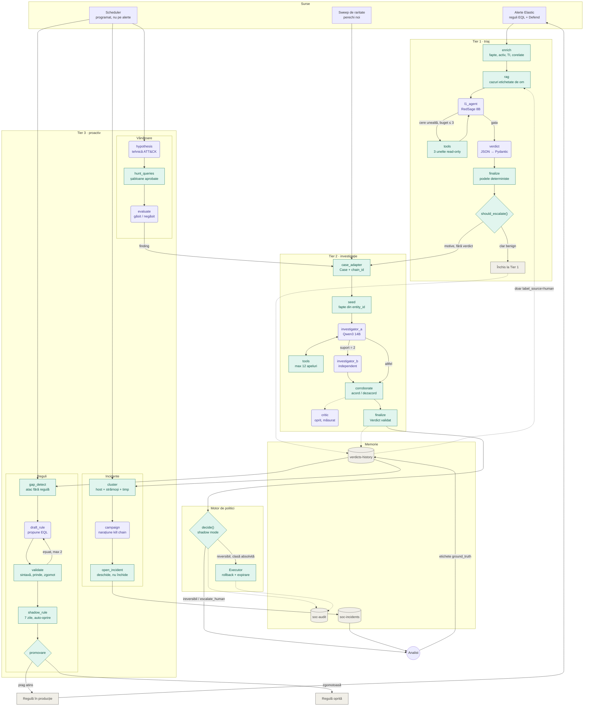

# Arhitectura tinta

Diagrama din conversatia de proiectare (claude.ai, 2026-10-08).

```mermaid
flowchart TD
  %% ============ NODURI ============
  subgraph SRC["Surse"]
    ALERTS["Alerte Elastic<br/>reguli EQL + Defend"]
    SWEEP["Sweep de raritate<br/>perechi noi"]
    SCHED["Scheduler<br/>programat, nu pe alerte"]
  end

  subgraph T1["Tier 1 · triaj"]
    T1_ENRICH["enrich<br/>fapte, activ, TI, corelate"]
    T1_RAG["rag<br/>cazuri etichetate de om"]
    T1_AGENT("l1_agent<br/>RedSage 8B")
    T1_TOOLS["tools<br/>3 unelte read-only"]
    T1_VERD("verdict<br/>JSON → Pydantic")
    T1_FIN["finalize<br/>podele deterministe"]
    T1_ESC{"should_escalate()"}
    CLOSED["Închis la Tier 1"]
  end

  subgraph T2["Tier 2 · investigație"]
    CASE["case_adapter<br/>Case + chain_id"]
    T2_SEED["seed<br/>fapte din entity_id"]
    T2_A("investigator_a<br/>Qwen3 14B")
    T2_TOOLS["tools<br/>max 12 apeluri"]
    T2_B("investigator_b<br/>independent")
    T2_COR["corroborate<br/>acord / dezacord"]
    T2_CRIT("critic<br/>oprit, măsurat")
    T2_FIN["finalize<br/>Verdict validat"]
  end

  subgraph POL["Motor de politici"]
    DECIDE{"decide()<br/>shadow mode"}
    EXEC["Executor<br/>rollback + expirare"]
  end

  subgraph T3["Tier 3 · proactiv"]
    subgraph HUNT["Vânătoare"]
      H1("hypothesis<br/>tehnică ATT&CK")
      H2["hunt_queries<br/>șabloane aprobate"]
      H3("evaluate<br/>găsit / negăsit")
    end
    subgraph CLUS["Incidente"]
      C1["cluster<br/>host + strămoși + timp"]
      C2("campaign<br/>narațiune kill chain")
      C3["open_incident<br/>deschide, nu închide"]
    end
    subgraph RULES["Reguli"]
      R1["gap_detect<br/>atac fără regulă"]
      R2("draft_rule<br/>propune EQL")
      R3["validate<br/>sintaxă, prinde, zgomot"]
      R4["shadow_rule<br/>7 zile, auto-oprire"]
      R5{"promovare"}
    end
  end

  subgraph MEM["Memorie"]
    HIST[("verdicts-history")]
    AUDIT[("soc-audit")]
    INC[("soc-incidents")]
  end

  HUMAN(("Analist"))
  PROD["Regulă în producție"]
  OFF["Regulă oprită"]

  %% ============ TIER 1 ============
  ALERTS --> T1_ENRICH --> T1_RAG --> T1_AGENT
  T1_AGENT -->|cere unealtă, buget ≤ 3| T1_TOOLS --> T1_AGENT
  T1_AGENT -->|gata| T1_VERD --> T1_FIN --> T1_ESC
  T1_ESC -->|clar benign| CLOSED
  T1_ESC -->|motive, fără verdict| CASE

  %% ============ TIER 2 ============
  SWEEP --> CASE
  CASE --> T2_SEED --> T2_A
  T2_A <--> T2_TOOLS
  T2_A -->|suport = 2| T2_B --> T2_COR
  T2_A -->|altfel| T2_COR
  T2_COR -.-> T2_CRIT
  T2_COR --> T2_FIN --> DECIDE

  %% ============ POLITICI ============
  DECIDE -->|reversibil, clasă absolvită| EXEC
  DECIDE -->|ireversibil / escalate_human| HUMAN

  %% ============ TIER 3 ============
  SCHED --> H1 & C1 & R1
  H1 --> H2 --> H3
  H3 -->|finding| CASE
  C1 --> C2 --> C3 --> INC --> HUMAN
  R1 --> R2 --> R3
  R3 -->|eșuat, max 2| R2
  R3 --> R4 --> R5
  R5 -->|prag atins| PROD --> ALERTS
  R5 -->|zgomotoasă| OFF

  %% ============ MEMORIE ȘI BUCLA DE ÎNVĂȚARE ============
  CLOSED -.-> HIST
  T2_FIN -.-> HIST
  DECIDE -.-> AUDIT
  EXEC -.-> AUDIT
  HIST --> C1
  HIST --> R1
  HUMAN -->|etichete ground_truth| HIST
  HIST -.->|doar label_source=human| T1_RAG

  %% ============ STILURI ============
  classDef model fill:#EEEDFE,stroke:#534AB7,color:#3C3489
  classDef code  fill:#E1F5EE,stroke:#0F6E56,color:#085041
  classDef store fill:#F1EFE8,stroke:#5F5E5A,color:#444441
  class T1_AGENT,T1_VERD,T2_A,T2_B,T2_CRIT,H1,H3,C2,R2 model
  class T1_ENRICH,T1_RAG,T1_TOOLS,T1_FIN,T1_ESC,CASE,T2_SEED,T2_TOOLS,T2_COR,T2_FIN,DECIDE,EXEC,H2,C1,C3,R1,R3,R4,R5 code
  class HIST,AUDIT,INC,CLOSED,PROD,OFF store

```
